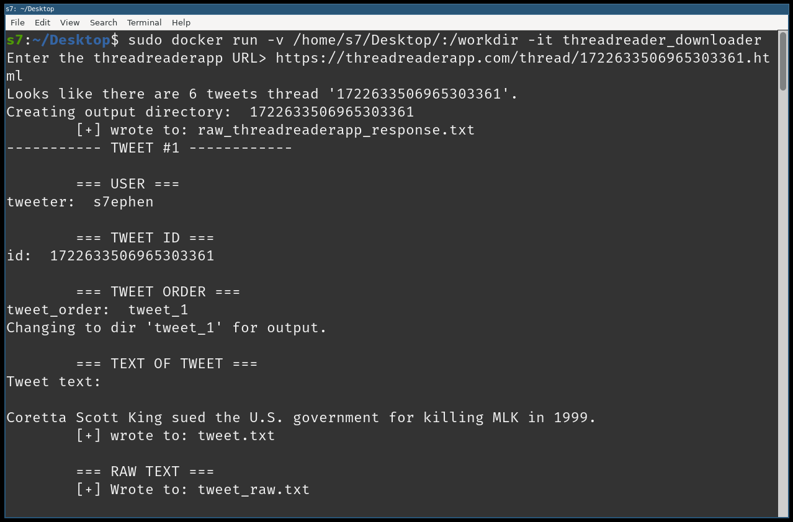
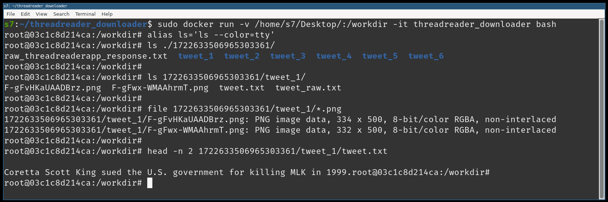
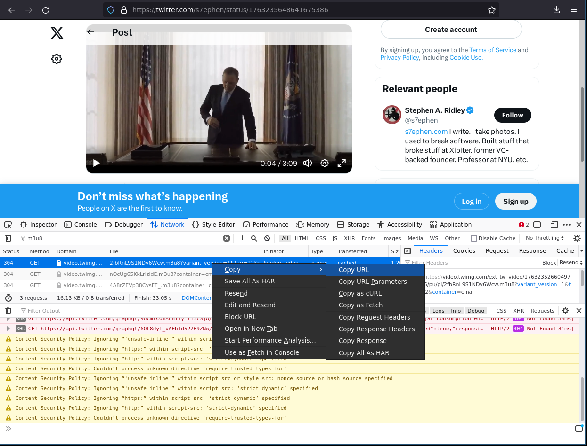
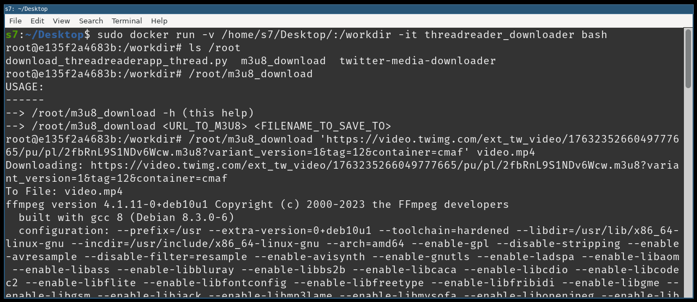

Automatically download each tweet in a ThreadReaderApp-archived Twitter thread.
This will also download all the media in each of the tweets.

# How to use it:
To use this docker container:

`docker run -v <dir_on_hostOS_for_downloads>/:/workdir -it sa7ori/threadreader_downloader` 

it will launch right into the downloader asking for a URL.


Then after everything has run, you'll get a directory like this:



Note: `<dir_on_hostOS_for_downloads>` is the fully qualified path of the directory
that will be shared into the docker container. The container will download and
log everything into that shared directory so it is available on the host.

Example:
 
`docker run -v /home/s7ephen/great_twitterthread/:/workdir -it sa7ori/threadreader_downloader`

# Link to the Dockerhub:
https://hub.docker.com/r/sa7ori/threadreader_downloader

# Using tools within the container:
To use the tools inside the container like m3u8_download to download
media from a m3u8 link, use:

`docker run -v <dir_on_hostOS_for_downloads>/:/workdir -it sa7ori/threadreader_downloader bash`

To use m3u8_download:

`m3u8_download https://urltosome/file/hosted/somwhere/v5dpHSFzJ33kY-QQ.m3u8 tweet_20.mp4`

This will use ffmpeg to parse and follow/download all the m3u8 interlinked files and download (and reassemble) the media fragments and save to tweet_20.mp4 or whatever filename you give it.

# Downloading Twitter Videos with m3u8_download:

You can use this to download videos directly from twitter also. To do this:
- Turn on your browser's "Developer Tools"
- Load (or reload) the tweet URL in your browser.
- In the "Network" tab, enter `m3u8` into the "filter"
- If you see no results, refresh the page.
- When a result appears (usually the first one) right clip and "Copy URL"
- Paste that full URL into m3u8_download.

Example:
fetching the m3u8

running m3u8_download
```
m3u8_download 'https://video.twimg.com/ext_tw_video/1763235266049777665/pu/pl/2fbRnL9S1NDv6Wcw.m3u8?variant_version=1&tag=12&container=cmaf' video.mp4
```  



